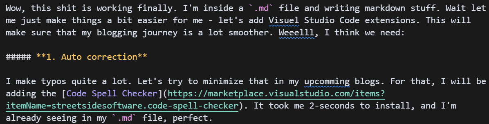
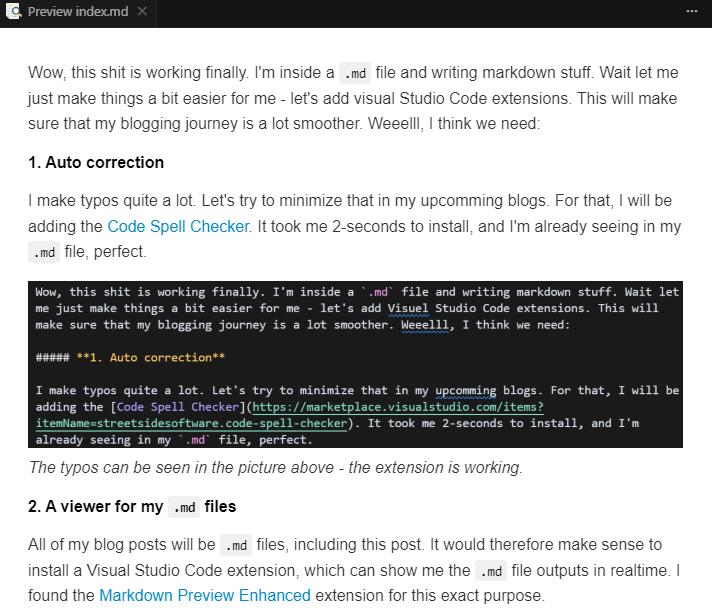

Wow, this shit is working finally. I'm inside a `.md` file and writing markdown stuff. Wait let me just make things a bit easier for me - let's add visual Studio Code extensions. This will make sure that my blogging journey is a lot smoother. Weeelll, I think we need:

##### **1. Auto correction** 

I make typos quite a lot. Let's try to minimize that in my upcomming blogs. For that, I will be adding the [Code Spell Checker](https://marketplace.visualstudio.com/items?itemName=streetsidesoftware.code-spell-checker). It took me 2-seconds to install, and I'm already seeing in my `.md` file, perfect. 

*The typos can be seen in the picture above - the extension is working.*

##### **2. A viewer for my `.md` files**
All of my blog posts will be `.md` files, including this post. It would therefore make sense to install a Visual Studio Code extension, which can show me the `.md` file outputs in realtime. I found the [Markdown Preview Enhanced](https://marketplace.visualstudio.com/items?itemName=shd101wyy.markdown-preview-enhanced) extension for this exact purpose. 

*We can now preview our MarkDown files. That's very useful.*

I think this is all we need for now. 

Although a few things that would be really cool to add would be stuff like LaTeX support in these `.md` files. That would make writing mathematics so much easier. I look forward to enhancing this blog platform by adding such compatibilities (together with like and comment functionalities and animations).

This total yapping platform is powered by [Gatsby](https://www.gatsbyjs.com/). 